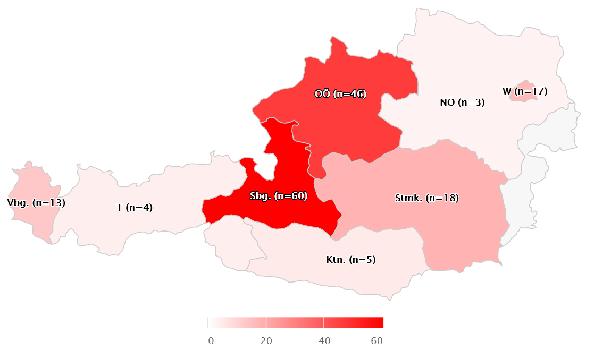
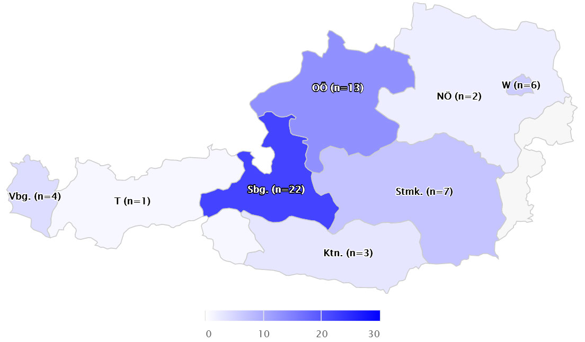
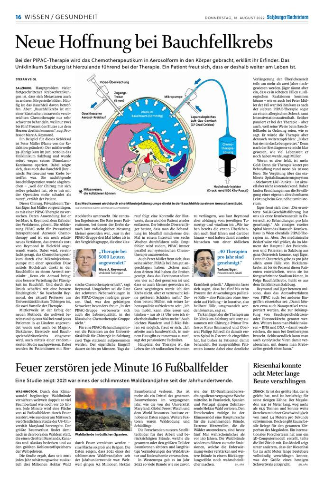

Am **17.11.2017** erfolgte an der **Universtitätsklinik für Chirurgie Salzburg** die **erste PIPAC (Pressurized intraperitoneal aerosol chemotherapy) in Österreich**. Seitdem sind in Salzburg über 180 PIPAC Prozeduren (Abb.1) bei 63 Patient/Innen (Abb. 2) durchgeführt worden (Stand 06/2022).
