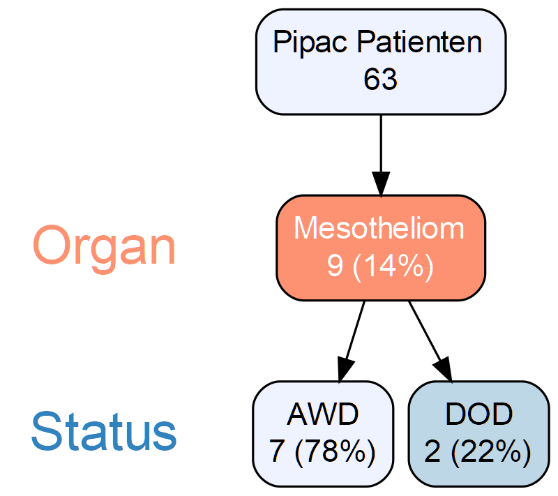
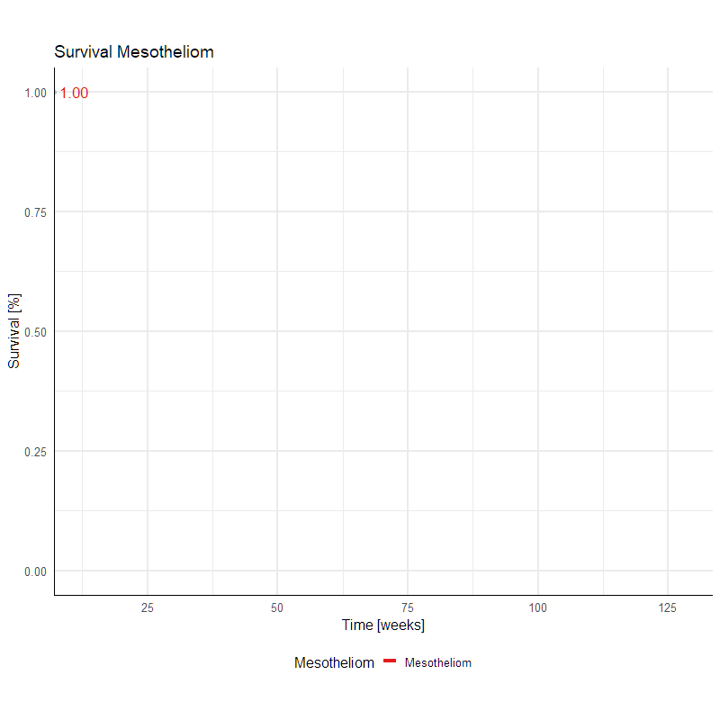

Das **maligne peritoneale Mesotheliom** ist eine seltene und aggressive Krebserkrankung im Bauchraum. Es besteht ein eindeutiger Zusammenhang zwischen der Erkrankung und der Asbestexposition. Das peritoneale Mesotheliom betrifft Männer und Frauen gleichermaßen. Dies steht im Gegensatz zum pleuralen Mesotheliom, bei dem das männliche Geschlecht häufiger betroffen ist.

Therapieoptionen: Die **hypertherme intraperitoneale Chemotherapie (HIPEC)** ist bei resektabler Erkrankung die 1. Methode, die zur Anwendung kommt. Hier konnten 5-Jahres Gesamtüberlebensraten von über 65% nachgewiesen werden. Bei nicht resektablen und somit fortgeschrittenen Erkrankungen stellt die palliative **PIPAC (pressurized intraperitoneal aerosol chemotherapy)** synchron mit der systemischen Therapie eine Option dar. Das 2-Jahres Gesamtüberleben von 9 in Salzburg behandelten Patient/Innen mit einem nicht resektablen peritonealen Mesotheliom beträgt aktuell 67%.

Patient/Innen mit systemischer Chemotherapie alleine haben im Mittel eine Lebenserwartung von 12 Monaten. Bei Patient/Innen, die keine Therapie in Anspruch nehmen wollen, beträgt die mittlere Lebeserwartung 6 Monate.

