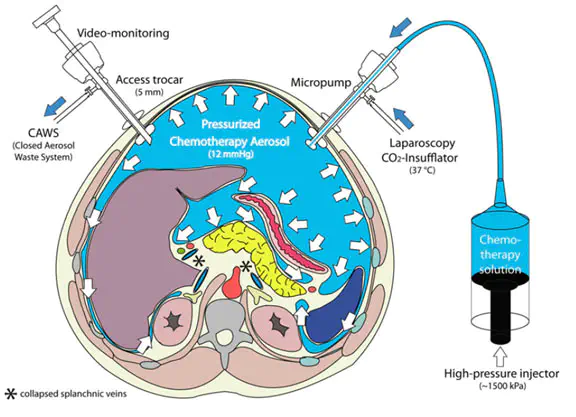

Die PIPAC ist ein Wirkstoffapplikationstool („Drug delivery system") und kann bei PatientInnen mit fortgeschrittenen peritonealen und pleuralen Malignomen angewendet werden.\
Durch die lokale Applikation des Chemotherapeutikums kommt es zu höheren Konzentrationen im Tumor bei gleichzeitiger geringer systemischer Toxizität. Die PIPAC wird laparoskopisch durchgeführt. Das normotherme Chemotherapeutikum wird in Aerosolform unter 12 mmHg intraperitonealem Druck über einen Trokar appliziert. Dabei wird eine homogene Verteilung des Chemotherapeutikums und ein tieferes Eindringen ins Gewebe erreicht.

## PIPAC Technologie

### Kapnoperitoneum

Durch die Insufflation von CO2 in die Bauchhöhle (Kapnoperitoneum) wird durch konstanten Druck von 12 mmHg eine Exposition der abdominellen Organe für einen laparoskopischen Eingriff erreicht. Nach Verwendung unterschiedlicher Gasgemische gilt heute das automatisierte Kapnoperitoneum, welches 1980 durch Semm et al. erstmals eingeführt wurde, als Goldstandard für die laparoskopische Operation (Semm, 1981).

Mit der PIPAC Methode kommt dem Kapnoperitoneum neben der alleinigen Exposition der Organe für eine adäquate laparoskopische Operation eine therapeutische Komponente hinzu. Dabei dient das Kapnoperitoneum als Träger eines als Aerosol vernebelten Wirkstoffes (Chemotherapeutikum bei der PIPAC). Zuerst wird über zwei Ballon-Trokare ein 12 mmHg Kapnoperitoneum angelegt. Dann wird der Vernebler (Capnomed©) eingeführt und mit einem Hochdruckinjektor verbunden.

Daraufhin wird das Chemotherapeutikum aus der flüssigen Form in die Aerosolform aerosolisiert. Das dichte System wird für 30 Minuten im Steady State gehalten. Am Ende wird das toxische Aerosol über ein geschlossenes System entsorgt. Die Prozedur erfolgt unter Schutz eines laminären Airflows und wird ferngesteuert.

Unter einem konstanten Druck von 12 mmHg kommt es neben einer homogenen Verteilung des als Aerosol vernebelten Chemotherapeutikums in der Bauchhöhle zu einer über den Druckgradienten beeinflussten besseren Diffusion des Chemotherapeutikums in das Gewebe (Abb. 2) (M. A. Reymond et al., 2000, 2000; Solass et al., 2014).

![Abb. 1: Schematische Darstellung der PIPAC Anwendung. Zuerst wird über zwei Ballon-Trokare ein 12 mmHg Kapnoperitoneum angelegt. Dann wird der Vernebler (CapnoPen©) [in der Skizze noch 1. Generation (Micropump©) dargestellt] eingeführt und mit einem Hochdruck- injektor verbunden. Daraufhin wird das Chemotherapeutikum aus der flüssigen Form in die Aerosolform aerosolisiert. Das dichte System wird für 30 Minuten im Steady State gehalten. Am Ende wird das toxische Aerosol über ein geschlossenes System entsorgt. Die Prozedur erfolgt unter Schutz eines laminären Airflows und wird ferngesteuert. Mit freundlicher Genehmigung Marc Reymond. Quelle: (Solass et al., 2014).](featured.jpg)

### Aerosol

Mit einem Aerosol wird die feinste Verteilung schwebender fester oder flüssiger Stoffe in Gasen beschrieben (Bsp.: Dampf, Rauch, Nebel). Bei der PIPAC werden dabei feinst verteilte Flüssigkeitstropfen in CO~2~ verteilt (Marc A. Reymond & Solass, 2014).

Historische Berichte zeugen davon, dass die Anwendung von Aerosolpartikeln zu medizinischen Zwecken bis in die Antike zurück reicht (Stein & Thiel, 2017). In der heutigen Anwendung kommen Aerosole in Druck-Dosier-Inhalatoren, Trockenpulver-Inhalatoren, medizinischen Zerstäubern, Lösungsnebel-Inhalatoren sowie Nasensprays vor.

In den europäischen Regulatorien für die Anwendung von Aerosolen in der Pulmonologie (EN481) werden dabei je nach Aufnahmeort in den Atemwegen Partikelgrößen für die Aerosole definiert. Aerosolpartikel mit einer Größe von \> 100 µm werden über den Nasen-, Mund und Rachenraum (Inhalationsfraktion), solche mit einer medianen Größe von ca. 12 µm unterhalb des Kehlkopfes bis zu den Alveolen (thorakale Fraktion) und jene mit einer medianen Partikelgrößen von ca. 4 µm in den Alveolen („respirable fraction") aufgenommen. Daraus ergibt sich die Rationale, dass die Aerosolparitkelgrößen bei der PIPAC nicht kleiner sein müssen als jene, für die pulmonale Anwendung (Marc A. Reymond & Solass, 2014).

Im Gegensatz zu den mittels eines Treibgases verwendeten Inhalatoren, die im Atmungstrakt zur Anwendung kommen, wird bei der PIPAC Methode eine flüssige Lösung (Chemotherapeutikum) über eine Düse in CO~2~ feinst verteilt (aerolosiert). Die gebildeten Aerosole haben dabei als eine disperse Lösung einen Durchmesser von 3-15 µm (Mittelwert 11 µm). Das liegt in dem Bereich, in dem medizinische Wirkstoffe als Aerosole zur Anwendung kommen (Durchmesser von 5-30 µm). Der Depositionsmechanismus („Niederschlag") und damit der Kontakt zum Gewebe findet über vier physikalische Prozesse statt (Marc A. Reymond & Solass, 2014):

1.  Sedimentation (der Schwerkraft folgend und zeitabhängig),

2.  Impaktion (Abscheidung großer und schneller Teilchen an Gabelungen oder Verengungen, z. B. in der Lunge bei der Applikation von Aerosolen),

3.  Diffusion (konzentrationsabhängig, Nanopartikel \< 0,5 µm)

4.  Interception („Abfangen", Bsp.: Fasern)

### PIPAC Indikation

Sämtliche nicht resektable peritoneale Malignome (primär und sekundär) kommen als Indikation in Frage. In einer 2017 publizierten systematischen Übersichtsarbeit wurden folgende Entitäten als Indikation beschrieben (Grass et al., 2017):

1.  Primäre peritoneale Malignome: Malignes peritoneales Mesotheliom, primäres peritoneales Karzinom und Pseudomyxoma peritonei.

2.  Sekundäre peritoneale Malignome: Peritoneal metastasiertes Magen-, Ovarial-, Appendix-, Tuben-, Kolorektal-, Zervix-, Endometrium- und Mammakarzinom.

3.  Weitere Indikationsgebiete sind peritoneale Metastasen von Pankreaskarzinomen und Karzinomen unbekannten Ursprung sowie primäre Dottersacktumore.
