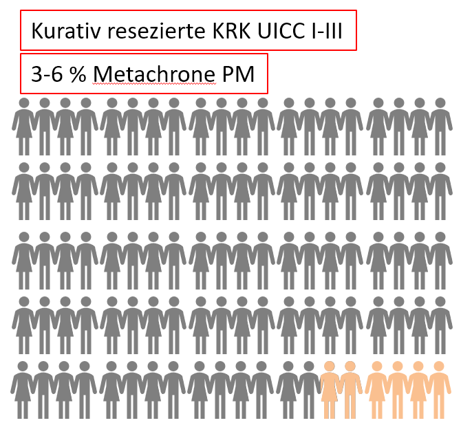
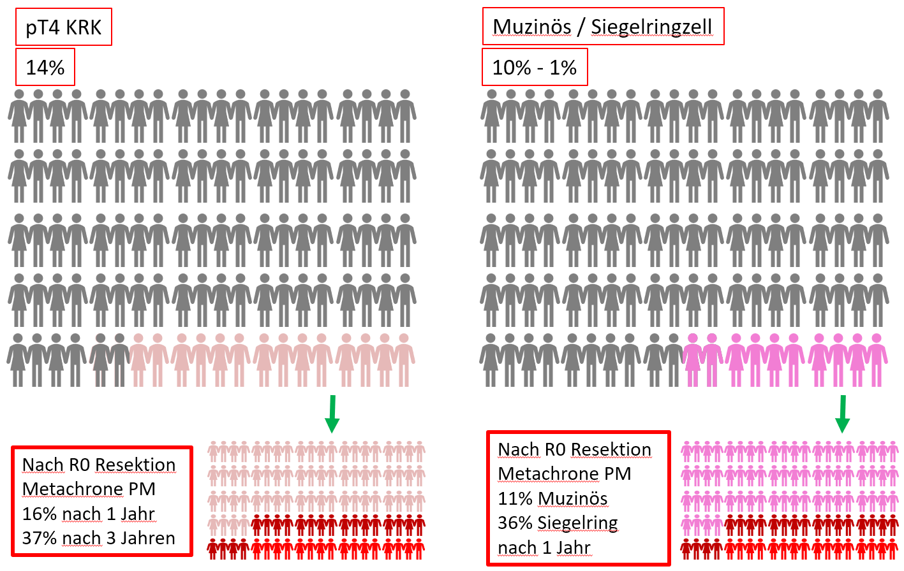

Das Risiko einer Peritonealkarzinose (besserer Begriff: einer [peritonealen Metastasierung (PM)]{style="color:red"} beim kolorektalen Karzinom (Darmkrebs) hängt von einigen Faktoren ab. Anhand des folgenden Beitrags sollen die unterschiedlichen Konstellationen bei der Entstehung einer peritonealen Metastasierung bei Darmkrebs veranschaulicht werden. Zusätzlich soll gezeigt werden, dass die Risikogruppe 10% beträgt und eine intensivere Behandlung benötigt ([Honoré et al. 2017](https://www.tandfonline.com/doi/pdf/10.1080/02656736.2017.1306119?needAccess=true)).

### 

{width="465"}

### 

{width="458"}

{width="461"}

{width="464"}
