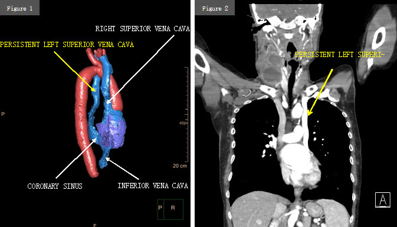

### Vorkommen

-   92% der persistierenden linken Vena cava superiorer (PLSVC) fließen in den Sinus coronarius (Abb. 1 und 2).

-   In 25% besteht eine sogenannte „innominate vein" zwischen PLSVC und der rechten V. cava superior.

-   8% der PLSVC fließen direkt in den linken Vorhof.

-   Ganz selten (0.1%) besteht eine PLSVC mit Fehlen der rechten V. cava superior.

### Fakten

-   Prävalenz: 0.5% in der Normalbevölkerung & 4% bei Patient/Innen mit angeborenen Herzfehlbildungen.

-   Die linke V. cava superior entsteht in der 7. Schwangerschaftswoche und ist normalerweise bei der Geburt obliteriert.

-   Eine PLSVC kann bei Interventionen (ZVK, Portimplantation) eine technische Herausforderung darstellen.

### Relevanz

-   Eine PLSVC kann bei Interventionen (ZVK, Portimplantation) eine technische Herausforderung darstellen.

### Referenz

1.  Biffi, M.; Boriani, G.; Frabetti,L.; et al. Left superior vena cava persistence in patients undergoing pacemaker or cardio-verter-defibrillator implantation: a 10-year experience. Chest. 2001 Jul;120(1):139-44.
