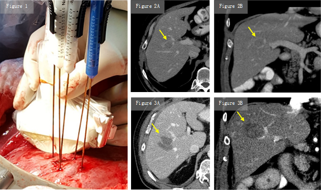

<<<<<<< HEAD
### Fakten:
=======
### Fakten
>>>>>>> e55178d7e68aa2e329780d2d8a4d8d8f018d5888

-   Durch schnelle elektrische Impulse werden die Zellmembranen der Krebszellen geöffnet und durch die Hochspannung der Zelltod der Krebszellen bewirkt.

-   Die irreversible Elektroporation (IRE) kommt bei der Behandlung von Lebertumoren (max. Größe 6 cm) dann zum Einsatz, wenn klassische Therapieoptionen (chirurgische Resektion) nicht angewendet werden können.

-   Vor allem bei Tumoren in der Nähe von Gefäßen kann eine Wirkung nachgewiesen werden. Die thermische Ablation von diesen Tumoren würde zu erhöhten Komplikationen bei unzureichender Tumordestruktion (Kühleffekt) führen.

-   Während der IRE können Blutgefässe und Gallengänge besser geschont werden.

<<<<<<< HEAD
### Relevanz:

-   In der Studie von Stroszczynski und Wiggermann\[1\] konnte bei 71 Patienten (nicht resektables HCC und nicht resektable kolorektale Karzinommetastasen) innerhalb eines Nachbeobachtungszeitraum von fünf Jahren gezeigt werden, dass die Patienten im Schnitt länger als zwei Jahre überlebten.

### Referenz:
=======
### Relevanz

-   In der Studie von Stroszczynski und Wiggermann\[1\] konnte bei 71 Patienten (nicht resektables HCC und nicht resektable kolorektale Karzinommetastasen) innerhalb eines Nachbeobachtungszeitraum von fünf Jahren gezeigt werden, dass die Patienten im Schnitt länger als zwei Jahre überlebten.

### Referenz
>>>>>>> e55178d7e68aa2e329780d2d8a4d8d8f018d5888

1.  Niessen C, Thumann S, Beyer L, et al. Percutaneous irreversible electroporation: long-term survival analysis of 71 patients with inoperable malignant hepatic tumors. Sci Rep \[Internet\]. 2017;7.
