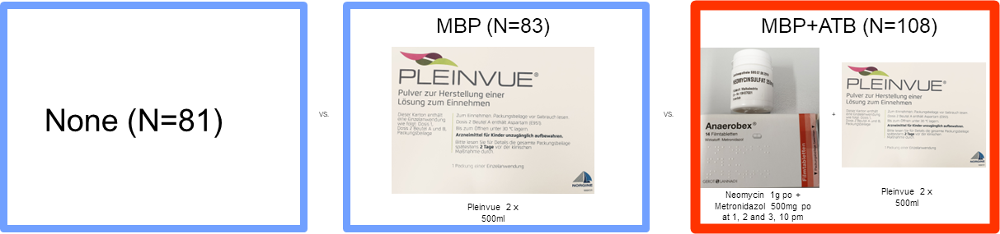
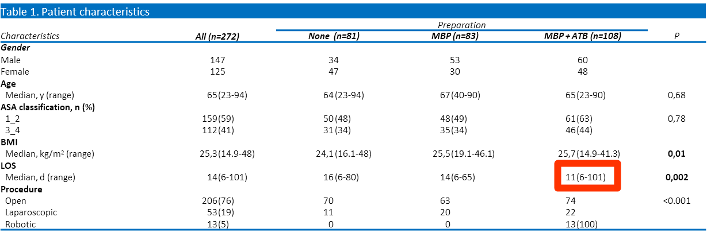
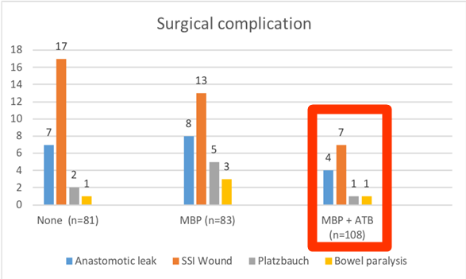
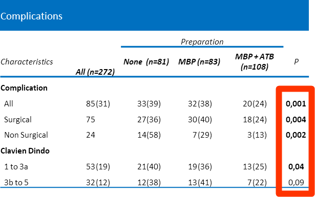

#### Combination of mechanical bowel preparation with oral antibiotics reduced postoperative morbidity in elective colorectal surgery

###### Presl J., Mitterwallner S., Ciftci S., Schredl P., Emmanuel K., Dinnewitzer A., Jäger T.

###### Department of Surgery, Paracelsus Medical University, Salzburg, Austria

------------------------------------------------------------------------

### Was reduziert postoperative Komplikationen nach Darmeingriffen?

1.  Mechanische Darmvorbereitung mit Antibiotika

2.  Mechanische Darmvorbereitung allein

3.  Keine Darmvorbereitung

------------------------------------------------------------------------

### 3 Gruppen

------------------------------------------------------------------------

### Patienten Charakteristika

------------------------------------------------------------------------

### Chirurgische Komplikationen

------------------------------------------------------------------------

### Komplikationen alle

------------------------------------------------------------------------

### Schlussfolgerung

In unserer Kohorte **reduzierte** die Kombination präoperative Darmvorbereitung und orale Antibiotika, die postoperative chirurgische und nicht-operative Komplikationen nach elektiven kolorektalen Eingriffen **signifikant**, und war mit einer **kürzeren Krankenhausverweildauer** verbunden.