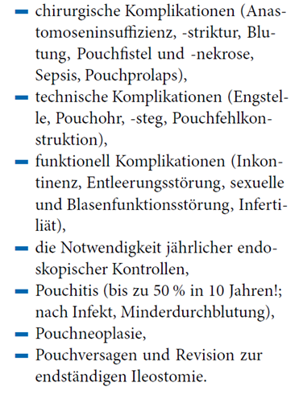

# Create slides in Markdown with Wowchemy

[Wowchemy](https://wowchemy.com/) \| [Documentation](https://wowchemy.com/docs/managing-content/#create-slides)

------------------------------------------------------------------------

## Indikation und Kontraindikation

#### Elektiv:

-   Therapirefraktäre Colitis ulcerosa

-   Epitheldysplasien oder Karzinome

-   Patientenwunsch

    #### Notfall:

-   Toxisches Megakolon, Ileus, Perforation, Blutung

    #### Kontraindikation:

-   Anale Inkontinenz, Perianales Fistelleiden, Tiefes Rektumkarzinom

--------------------------------------------------------------------------

## Patientenaufklärung

------------------------------------------------------------------------

## Lagerung

------------------------------------------------------------------------

# Questions?

[Ask](https://github.com/wowchemy/wowchemy-hugo-modules/discussions)

[Documentation](https://wowchemy.com/docs/managing-content/#create-slides)
