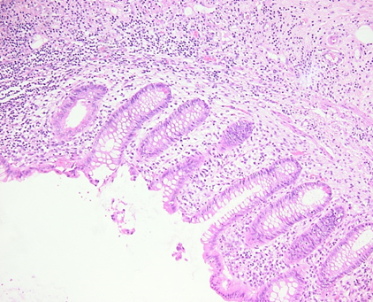

## Neutropene Enterokolitis

#### T. Jäger, T. Leibold, S. Kerber, K.-P. Thon

###### Abteilung für Allgemein- und Viszeralchirurgie (Chefarzt Prof. Dr. Dr. h.c. K.-P. Thon) Robert-Bosch-Krankenhaus, Stuttgart

------------------------------------------------------------------------

### Hintergrund

-   Typhlitis beschreibt eine Entzündung des Blinddarms
-   Ist von einer Appendizitis abzugrenzen
-   Betrifft Patienten mit **hämatologischen Neoplasien** im Rahmen der **Chemotherapie-induzierten Neutropenie**
-   Bei Sepsis Letalität 50–100 %

------------------------------------------------------------------------

### Neutropene Enterokolitis

Abb.1: Neutropene Enterokolitis im Zökum (Typhlitis). Zirkuläre Wandverdickung (Pfeil) mit Reaktion des umliegenden Gewebes.

------------------------------------------------------------------------

### Neutropene Enterokolitis

Abb.2: Histologisches Präparat der Appendixschleimhaut ohne Entzündungszeichen.

------------------------------------------------------------------------

### Neutropene Enterokolitis

Abb.3: Histologisches Präparat der Appendixwand mit Fibrinauflagerungen als Zeichen einer Periappendizitis im Rahmen einer Typhlitis.

------------------------------------------------------------------------

### Neutropene Enterokolitis

------------------------------------------------------------------------

### Neutropene Enterokolitis

------------------------------------------------------------------------

### Neutropene Enterokolitis

Abb.4: Neutropene Enterokolitis im Jejunum. Typisches Bild eines Target Zeichens (Pfeil). Kontrastmittelaufnahme der Mukosa und ödematöse Wandverdickung.

------------------------------------------------------------------------

### Schlussfolgerung

-   Klinische Unterscheidung Typhlitis - Appendizitis schwierig
-   Therapeutische Vorgehen wird kontrovers diskutiert
-   Chirurgische Therapie bei Progredienz, Perforation, Blutung oder Abszedierung